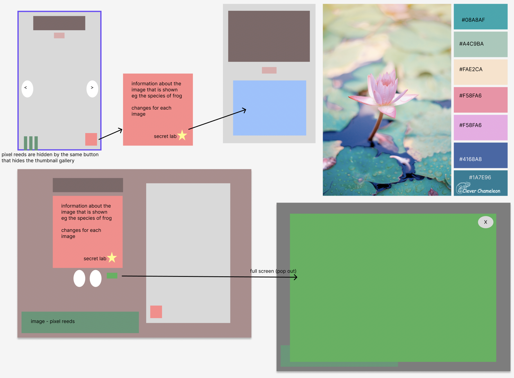

# Lilypad Library

A small, reactive image gallery that allows you to explore life around the pond! Take a look and see what you can find! 🐸🦎🌾

## Aims, Planning and Design

This assignment started with big dreams to far surpass the MVP that (very very quickly) got scaled down. More on that in the reflection section!

Once again I used Figma in order to design my wireframes -- although I know they still leave something to be desired in terms of fitting the expectations of a "typical" wireframe, it was enough to let me begin work on the app. I themed the design around the idea of observing wildlife around a local pond, as this would allow me to scale from the API provided by Joe to a custom query using the Unsplash API.

I used a <a href="https://i0.wp.com/cleverchameleon.com.au/wp-content/uploads/2017/05/lily-pad-glow2.png?w=1050&ssl=1">colour palette</a> created from a photograph of a water lily (website in the resources section) and a <a href="https://fonts.google.com/specimen/Manrope">monospace-based</a> font from Google fonts.

Mobile-first design continues to be something I need to conciously remind myself to do, but I do hope that this will become second-nature to me. I am curious about replicating the <a href="https://jp.marugame.com/menu/tomatamacurry/">desktop styling</a> I explored earlier in the week, although I'm unsure that I will have the time/skills to do so (this is the same for some other fun react experiments I want to attempt).

## The Building

I'm not too proud to admit this brought me to tears (×_×)⌒☆ I think this was the combination of the step-up re:learning React + the fact that (realistically) my focus was not great this week thanks to my illness (AND + the fact that I had spent about 30 minutes trying to fix an issue that ended up being an issue I already believed I had fixed).

Getting the API from Unsplash was actually the first thing I got working (along with a query so that the images shown would be on-theme) but as I was building the app around this, I found keeping both the more complicated API and the component tree in my mind proved a little difficult for one reason or another. This meant that, as I was building the app, I switched out the .env value for the provided frog API.

Building happened slowly, and while my original plan had a component for the Thumbnail gallery and another for the Thumbnail image themselves (with this idea repeated for the fullscreen image), it was just a little too much for me to keep track of and I found that bringing it down to just thumbnail + fullscreen components allowed me to progress somewhat more confidently.

Once I had a working MVP (where I could click a thumbnail icon and see the same image displayed in the main frame) I pushed a branch to git and began the experimenting that would allow me to get closer to what I originally imagined (conditional rendering and a pop-out window that displayed information about the chosen image).

Mapping in the "wrong" place was something that haunted me from the beginning of the project, and I'm disappointed to say that I couldn't get a strong enough understanding of "how to write it" (so to speak). I believe the answer to what I wanted was to first fetch the API in app, then to pass the props along to a container in which I would map the images, meaning that when they were created they would be able to be styled via the container. I watched the recording of our class on props and read over our notes, as well as reading a few online examples, however I couldn't find a working example of what I was imagining, so I couldn't identify where I kept going wrong. The result is an app I am not happy with, styling wise, but I prioritised function over style.... THIS time.

## Resources

⭐️ <a href="https://www.vecteezy.com/vector-art/54977270-water-lily-icon">Water lily icon Vectors by Vecteezy</a>

⭐️ <a href="https://cleverchameleon.com.au/">Clever Chameleon Quilting</a>

⭐️ <a href="https://www.vecteezy.com/vector-art/121441-cattails-vector">Cattails Vector Vectors by Vecteezy</a>
